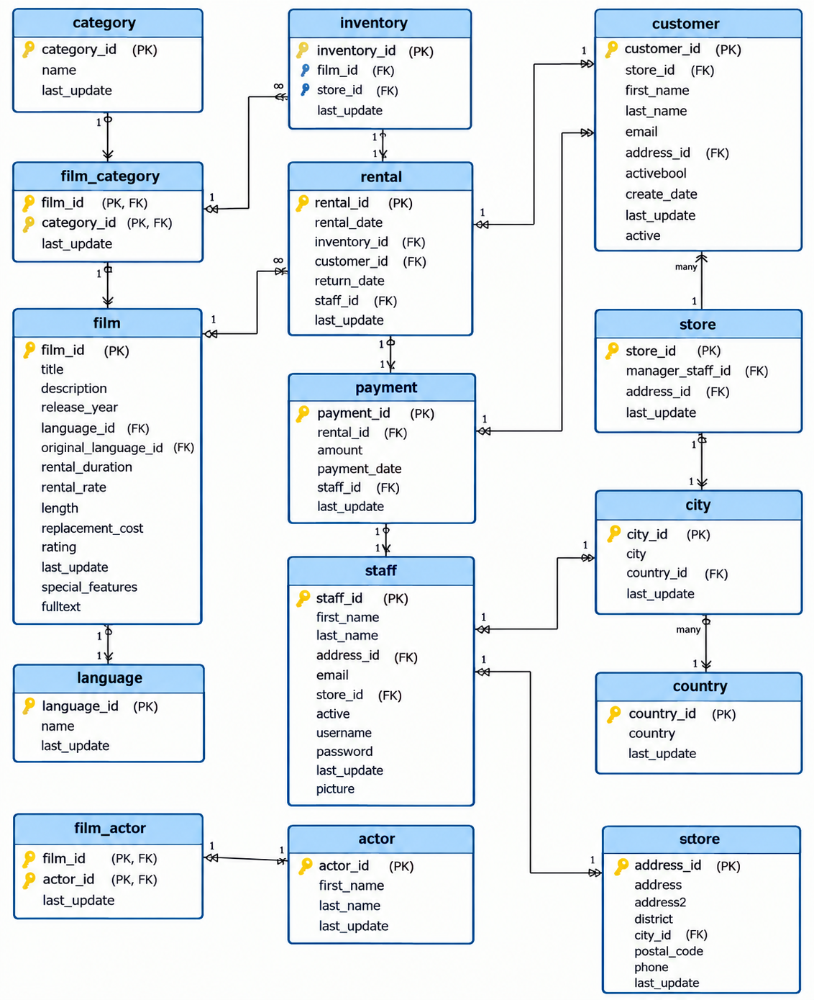

## 📊 Modelo de Dados: Banco de Dados DVD Rental

O banco de dados de exemplo **DVD Rental** representa a operação de uma locadora de filmes e é composto por **15 tabelas**, organizadas para exemplificar relacionamentos complexos de um domínio real (*1:1, 1:N e N:M*).

---

### 📂 Estrutura e Descrição das Tabelas

Para facilitar a compreensão do domínio, as tabelas estão agrupadas por contexto de negócio:

#### 🎬 Catálogo de Filmes e Elenco
* `film`: Armazena as informações dos filmes (título, ano de lançamento, duração, classificação indicativa, custo de substituição, etc.).
* `actor`: Registra os atores e atrizes (nome e sobrenome).
* `film_actor`: Tabela associativa que mapeia o relacionamento *muitos-para-muitos* ($\text{N:M}$) entre filmes e atores.
* `category`: Define os gêneros/categorias dos filmes (Ação, Comédia, Drama, etc.).
* `film_category`: Tabela associativa que mapeia o relacionamento *muitos-para-muitos* ($\text{N:M}$) entre filmes e categorias.
* `language`: *(Tabela do modelo)* Armazena os idiomas disponíveis para áudio e legendas dos filmes.

#### 🏬 Operação de Estoque, Locação e Clientes
* `customer`: Registra os dados cadastrais dos clientes ativos e inativos da locadora.
* `store`: Armazena os dados das filiais/lojas, vinculando o funcionário gerente e o endereço.
* `inventory`: Gerencia os itens físicos em estoque (cópias das mídias disponíveis em cada loja).
* `rental`: Mapeia as transações de empréstimo de mídias (data de locação, data de devolução, cliente e item do estoque).
* `payment`: Armazena os registros financeiros de pagamentos efetuados pelos clientes em cada locação.
* `staff`: Guarda as informações dos funcionários que operam o sistema e atendem nas lojas.

#### 📍 Endereço e Localização
* `address`: Contém as informações de endereço (rua, bairro, código postal e telefone) associadas a clientes, funcionários e lojas.
* `city`: Armazena os nomes das cidades e chave estrangeira para o país.
* `country`: Armazena a lista de países cadastrados.

---
     

### 🖼️ Diagrama Entidade-Relacionamento (DER)

