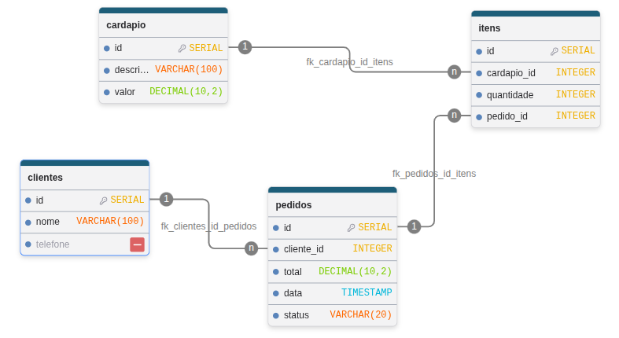

# 🍕 Banco de Dados - Pizzaria

Documentação e scripts para modelagem, criação e povoamento do banco de dados relacional para gestão de pedidos de uma pizzaria.

---

## 📌 Diagrama Entidade-Relacionamento (DER)

Abaixo está a representação visual do modelo de dados criado no **draw.db**:

---

## 🗂️ Estrutura das Tabelas

### 👤 Clientes
Armazena as informações dos clientes cadastrados.

| Name | Type | Settings | References | Note |
| :--- | :--- | :--- | :--- | :--- |
| **id** | SERIAL | 🔑 PK, NOT NULL | — | Identificador único |
| **nome** | VARCHAR(100) | NOT NULL | — | Nome completo |
| **telefone** | VARCHAR(20) | NOT NULL | — | Telefone/WhatsApp |

---

### 🍕 Cardápio
Cadastra os produtos disponíveis para venda (pizzas, bebidas, sobremesas).

| Name | Type | Settings | References | Note |
| :--- | :--- | :--- | :--- | :--- |
| **id** | SERIAL | 🔑 PK, NOT NULL | — | Identificador único |
| **descricao** | VARCHAR(100) | NOT NULL | — | Nome/descrição do item |
| **valor** | DECIMAL(10,2) | NOT NULL | — | Preço unitário em R$ |

---

### 📦 Pedidos
Registra o cabeçalho das vendas efetuadas.

| Name | Type | Settings | References | Note |
| :--- | :--- | :--- | :--- | :--- |
| **id** | SERIAL | 🔑 PK, NOT NULL | — | Número do pedido |
| **total** | DECIMAL(10,2) | NULL | — | Valor total (`CHECK > 0`) |
| **data** | TIMESTAMP | DEFAULT `NOW()` | — | Data e hora do pedido |
| **status** | status_pedido_enum | DEFAULT `'Pendente'` | — | `Pendente`, `Entregue`, `Cancelado` |
| **cliente_id** | INTEGER | NULL | `clientes(id)` | Cliente associado |

---

### 🛒 Itens
Relaciona os produtos do cardápio aos pedidos (tabela associativa).

| Name | Type | Settings | References | Note |
| :--- | :--- | :--- | :--- | :--- |
| **id** | SERIAL | 🔑 PK, NOT NULL | — | Identificador único do item |
| **pedido_id** | INTEGER | NULL | `pedidos(id)` | Pedido ao qual pertence |
| **cardapio_id** | INTEGER | NULL | `cardapio(id)` | Produto do cardápio |
| **quantidade** | INTEGER | NULL | — | Unidades pedidas (`CHECK > 0`) |

---

## ⚙️ Scripts de Gerenciamento do Banco (SQL)

Para rodar e praticar com a base de dados em sala de aula, utilize os scripts localizados na pasta `scripts/` na ordem apresentada:

1. **[script-create-tables.sql](./scripts/script-create-tables.sql)**  
   Cria a estrutura base do banco de dados (tabelas, tipos enumerados, chaves primárias/estrangeiras e restrições `CHECK`).

2. **[script-loading-data.sql](./scripts/script-loading-data.sql)**  
   Script guiado para uso ao vivo com os estudantes para praticar comandos básicos de `INSERT` e entender a integridade referencial.

3. **[script-insert-data.sql](./scripts/script-insert-data.sql)**  
   Carga de dados em lote contendo a série histórica de pedidos para exercitar consultas analíticas (`GROUP BY`, `JOIN`, `SUM`, `AVG`).

---

## 📚 Guias Práticos e Consultas (How To)

Na pasta `howto/`, você encontra os roteiros de consultas organizados por etapas de aprendizado:

1. **[querys-parte1.md](./howto/querys-parte1.md)**  
   Comandos essenciais de manipulação (`INSERT`, `UPDATE`, `DELETE`) e consultas fundamentais (`WHERE`, `GROUP BY`, `LIKE`, `INNER JOIN`).

2. **[querys-parte2.md](./howto/querys-parte2.md)**  
   Consultas analíticas e avançadas de negócios (`SUM`, `AVG`, formatação de moeda em R$, indicadores de desempenho e taxa de cancelamento).